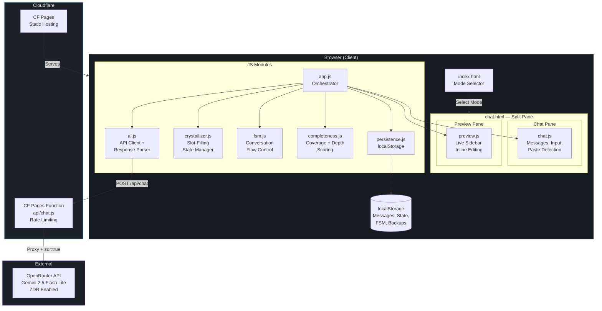

# Crystallization Wizard v3.5

Turn your thoughts into structured clarity through conversation.

A conversational chatbot that helps you build structured personal context files (like [Telos](https://github.com/danielmiessler/Telos) or bucket lists) through natural dialogue instead of form-filling. The AI extracts and organizes your thoughts in real-time as you talk.

## How It Works

1. Pick a mode (Bucket List, Telos, etc.)
2. Have a conversation — the AI asks questions and you respond naturally
3. Watch the sidebar fill up as your thoughts are crystallized into structured sections
4. Double-click any item in the sidebar to edit it
5. Download or copy your completed document

See the [full help page](https://crystallization-wizard.pages.dev/help.html) for details on importing existing notes, persistence, and more.

## Features

- **Conversational extraction** — AI parses freeform responses into structured data
- **Live preview sidebar** — see your document take shape as you talk
- **Editable preview** — double-click any extracted item to refine it
- **Cross-pollination** — a single response can populate multiple sections
- **Multi-session resume** — pick up where you left off with a welcome-back message
- **Completeness scoring** — coverage + depth heuristics tell you when you're done
- **Document import** — paste or upload existing text/markdown and the AI sorts it into sections
- **Undo import** — one-click restore if the import wasn't right
- **Dynamic filenames** — downloads named `your_{mode}_{date}.md` for easy organization
- **Extensible modes** — add new document types as JSON config files
- **Privacy-first** — all data stays in your browser's localStorage; LLM calls use zero data retention

## Modes

| Mode | Sections | Description |
|------|----------|-------------|
| Bucket List | 8 | Life goals and dreams by category |
| Telos | 17 | Personal context file (history, mission, goals, beliefs, etc.) |

## Tech Stack

- Vanilla JS (no frameworks)
- Cloudflare Pages + Pages Functions
- OpenRouter API (Gemini 2.5 Flash Lite, zero data retention)
- localStorage for persistence

## Setup

```bash
# Install dependencies
bun install

# Run locally
bun run dev

# Deploy to Cloudflare Pages
bun run deploy
```

### Environment

The Cloudflare Pages Function requires an `OPENROUTER_API_KEY` secret:

```bash
bun x wrangler pages secret put OPENROUTER_API_KEY --project-name crystallization-wizard
```

## Adding Modes

Create a JSON file in `public/modes/` following the schema:

```json
{
  "id": "your-mode",
  "name": "Your Mode Name",
  "description": "What this mode helps you build.",
  "output_filename": "output.md",
  "opening_prompt": "First message the AI sends.",
  "system_prompt": "Instructions for the AI...",
  "completeness": { "minimum_sections": 5, "depth_threshold_entries": 2, "depth_threshold_words": 30 },
  "sections": [
    { "id": "section-id", "title": "Section Title", "description": "...", "output_header": "## SECTION", "prompts": ["..."] }
  ],
  "preamble": "# Document header\n"
}
```

Then add it to the `modes` array in `public/index.html`.

## Architecture



### File Structure

```
public/
  index.html          — Landing page with mode selector
  chat.html           — Split-pane chat interface
  css/style.css       — Dark theme
  js/
    app.js            — Orchestrator
    ai.js             — OpenRouter API client + response parser
    chat.js           — Chat UI (bubbles, typing indicator)
    crystallizer.js   — Slot-filling state manager
    completeness.js   — Coverage + depth scoring
    fsm.js            — Finite state machine for section tracking
    persistence.js    — localStorage save/load
    preview.js        — Sidebar renderer with inline editing
  modes/
    telos.json        — Telos mode config (17 sections)
    bucket-list.json  — Bucket List mode config (8 sections)
functions/
  api/chat.js         — CF Pages Function (OpenRouter proxy + rate limiting)
```

## License

MIT
